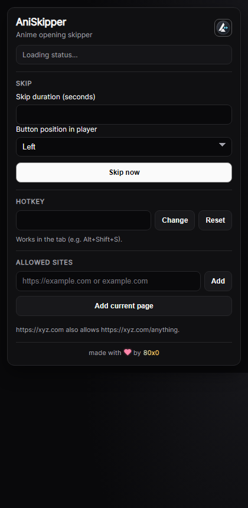

# AniSkipper

Lightweight browser extension to skip anime openings in one click.

## Showcase


## Features
- Floating skip button directly inside the video player
- Custom skip duration
- Configurable hotkey
- Allowed-site list (manual entry or add current page)
- Player button position switch (left/right)
- Automatic UI language:
  - German browser -> German UI
  - English browser or any other language -> English UI
- Supports Firefox and Chromium-based browsers (Chrome, Opera, etc.)

## Install
### Firefox
1. Open `about:debugging#/runtime/this-firefox`
2. Click `Load Temporary Add-on`
3. Select `AniSkipper/manifest.json`

### Chrome / Opera
1. Build or use `dist/AniSkipper-chrome-<version>.zip`
2. Unpack the zip
3. Open `chrome://extensions` or `opera://extensions`
4. Enable Developer Mode
5. Click `Load unpacked` and select the unpacked folder

## Build
```powershell
.\AniSkipper\build-xpi.ps1
.\AniSkipper\build-chrome.ps1
```

## Usage
1. Open the popup and allow your current page
2. Set skip seconds, hotkey, and button side
3. Skip with the player button or your hotkey
