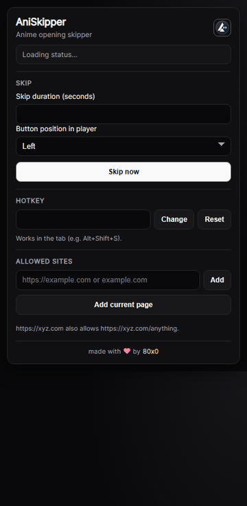

# AniSkipper

Lightweight browser extension to skip anime openings in one click.

## Showcase


## Features
- Floating skip button directly inside the video player
- Custom skip duration
- Configurable hotkey
- Allowed-site list (manual entry or add current page)
- Player button position switch (left/right)
- Automatic UI language:
  - German browser -> German UI
  - English browser or any other language -> English UI
- Supports Firefox and Chromium-based browsers (Chrome, Opera, etc.)

## Install
### From GitHub Releases (recommended)
#### Firefox
1. Open this file in Firefox: [AniSkipper Firefox (latest)](https://github.com/int80x0/AniSkipper/releases/download/aniskipper-latest/AniSkipper-firefox-latest.xpi)
2. Confirm the install prompt.
3. If Firefox refuses the file as unsigned/corrupt, use the temporary install method below.

#### Chrome / Opera / Edge
1. Download: [AniSkipper Chromium (latest)](https://github.com/int80x0/AniSkipper/releases/download/aniskipper-latest/AniSkipper-chrome-latest.zip)
2. Open your extension page:
   - Chrome: `chrome://extensions`
   - Opera: `opera://extensions`
   - Edge: `edge://extensions`
3. Enable Developer Mode.
4. Drag and drop the ZIP into the extension page.
5. If drag and drop is blocked, unzip and use `Load unpacked`.

### Temporary local install (dev)
#### Firefox
1. Open `about:debugging#/runtime/this-firefox`
2. Click `Load Temporary Add-on`
3. Select `AniSkipper/manifest.json`

## Build
```powershell
.\AniSkipper\build-xpi.ps1
.\AniSkipper\build-chrome.ps1
```

Build outputs:
- `dist/AniSkipper-firefox-<version>.xpi`
- `dist/AniSkipper-chrome-<version>.zip`

## Usage
1. Open the popup and allow your current page
2. Set skip seconds, hotkey, and button side
3. Skip with the player button or your hotkey
